# AE2DMS-Yizirui Fang-20127091

This project is AE2DMS coursework, Sokoban, built with **Java**, **JavaFX**, and **GSON**. This project is tested by **JUnit**, and **Assertj**, and **TestFX**.

## Download

```
git clone git@csprojects.nottingham.edu.cn:scyyf1/ae2dms-cw-20127091.git
```

## Execute

To run this, you should apply VM option,

```
--module-path "$JAVAFX_PATH$" --add-modules javafx.controls,javafx.fxml,javafx.web
```

## Refactor

### Design Pattern

| Design Pattern  | Class                            | Brief                                                        |
| --------------- | -------------------------------- | ------------------------------------------------------------ |
| **Singleton**   | [`GameLogger`]()                 | This is to make sure only one logger                         |
| **Factory**     | [`GraphicObjectFactory`]()       | This is to create object without exposing the creation logic to the client. |
| **Observer**    | [`GamePageController`]()         | Any property modified, its dependent objects are to be notified automatically. |
| **Iterator**    | [`GameMap`]()                    | Access the elements of a collection `Levels` in sequential manner. |
| **MVC pattern** | Controller, Model, View packages | Break the components into 3 packages. The **controller** is to acts on both model and view. The **model** is to **Game Execution Logic**. The **view** package is the visualization of model working together with the view resources in the resources directory. |


### Divide, conquer and quick wins refactoring

| Type                            | Class                                                        | Brief                                                        |
| ------------------------------- | ------------------------------------------------------------ | ------------------------------------------------------------ |
| GUI design                      | view resources                                               | The GUI is refactored the widgets of this project, designing with Above XD. |
| Remove dead code                | `GameEnigine`, `GameGrid`                                    | I largely remove all unused methods and code in  these classes |
| Enhance identifier naming       | `input`, `code` in `GameEngine`, `raw_level` in `Level`, `obj` and `ft` in `GraphicObject` | I refactor the variables name to self-explaining ones        |
| Reduce method size              | Extracted methods to new class `FileOperator` for all operations about the file chooser | I split the given methods in `Main`, `GameEnigne` to make the classes and methods |
| Enhance component encapsulation | Apply `private` on those methods only used in the class it-self |                                                              |

## Project Class Diagram

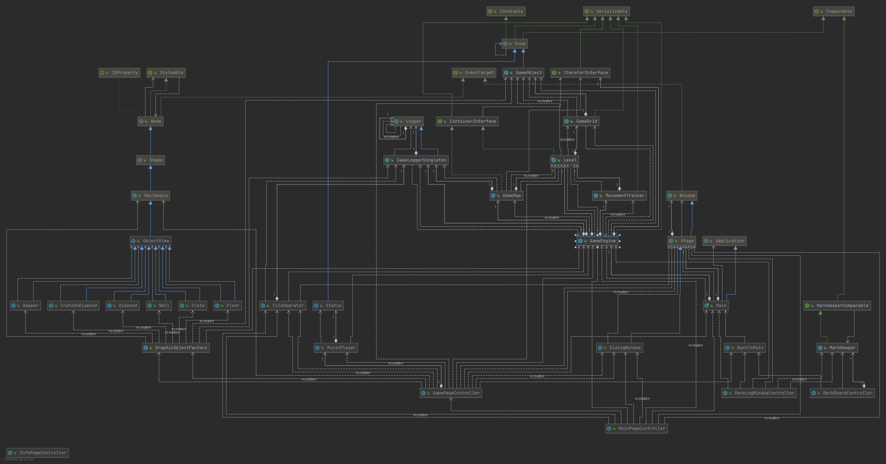

### Singleton pattern diagram

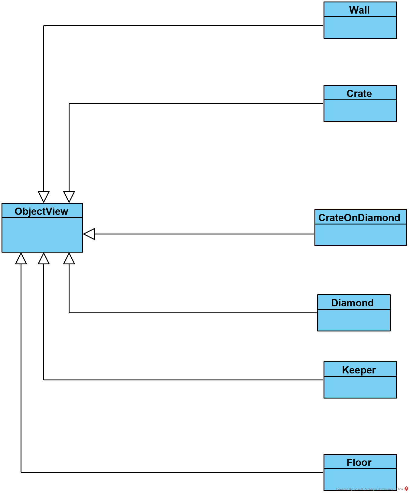

## Additional Feature

### Mini Web Browser

The homepage of this web browser is the user guide of this game. This browser is equipped with URL field, back, forward, and view icon for project repository redirection. The URL will automatically change according to the current page.

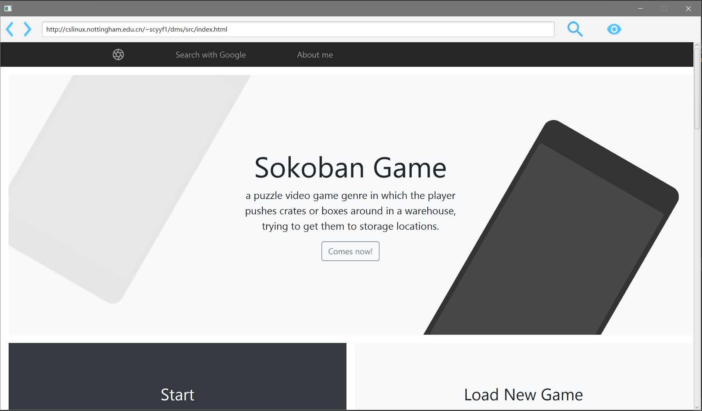

### High Mark Board

This is to present the **top 5 mark records** of the map selected in the combo box. 

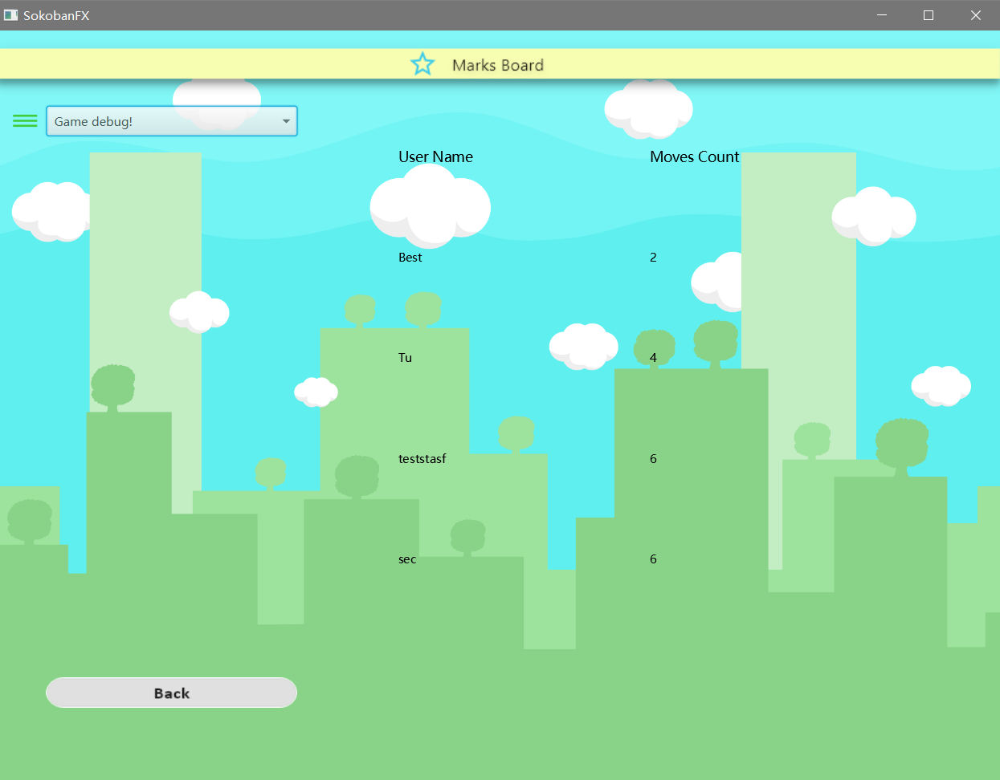

### Load Saved Game

This feature is to load the previously saved game file and resume everything.

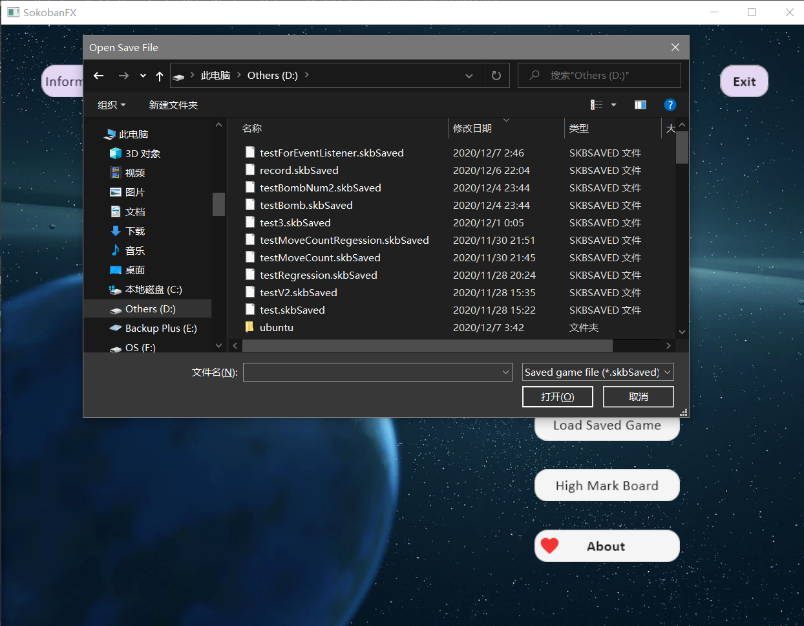

### Current Moves Count

This feature is to count and present the moves count in the current level dynamically. 

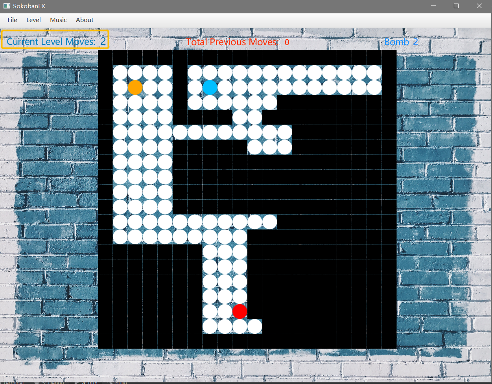

### Total previous move count

This feature is to log and record the moves count you have in all previous levels of this map.

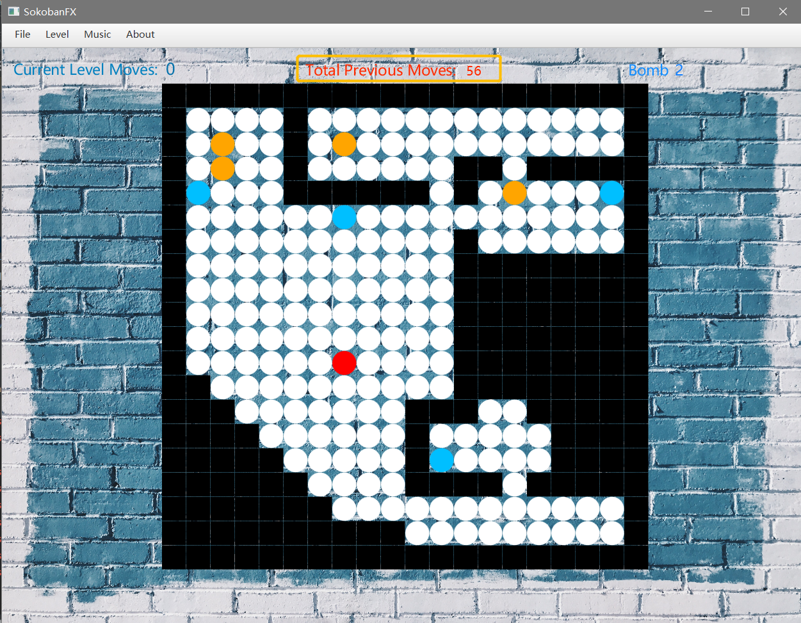

### Wall Bombs

This feature is to destroy the wall by bombs. By default, a user will have 2 bombs at the start and can use by clicking the wall. Once use the number of bomb present in the scene will change accordingly.

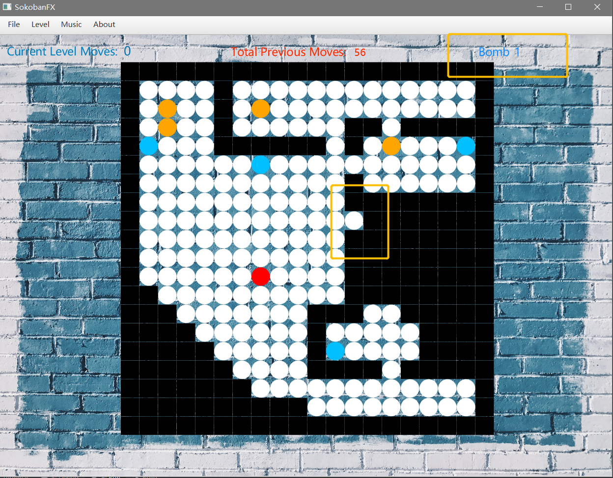

### Load Music

This feature is to allow user load the user-specified music to the game. Please note only pure **.wav** format music file is allowed.

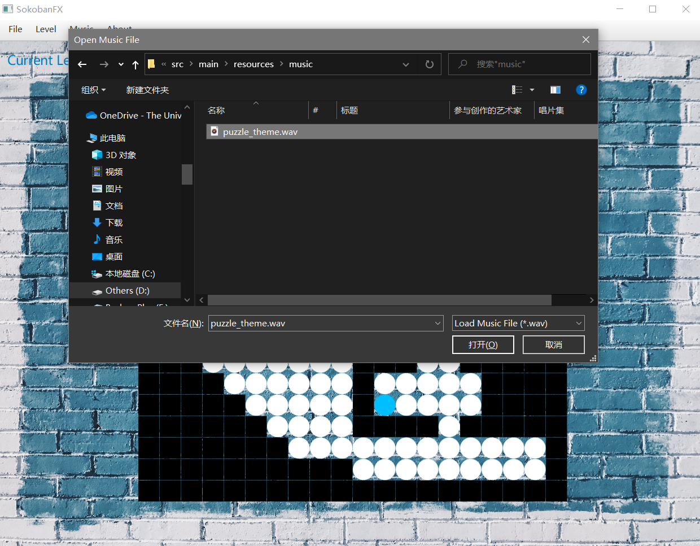 

### Restart Music

This feature is to restart the currently playing music. Please note, in this operation, there is chance that the program will struck. If you meet with this issue, please   **invalidate and restart the IDE** execute the program with IDE Debug mode.

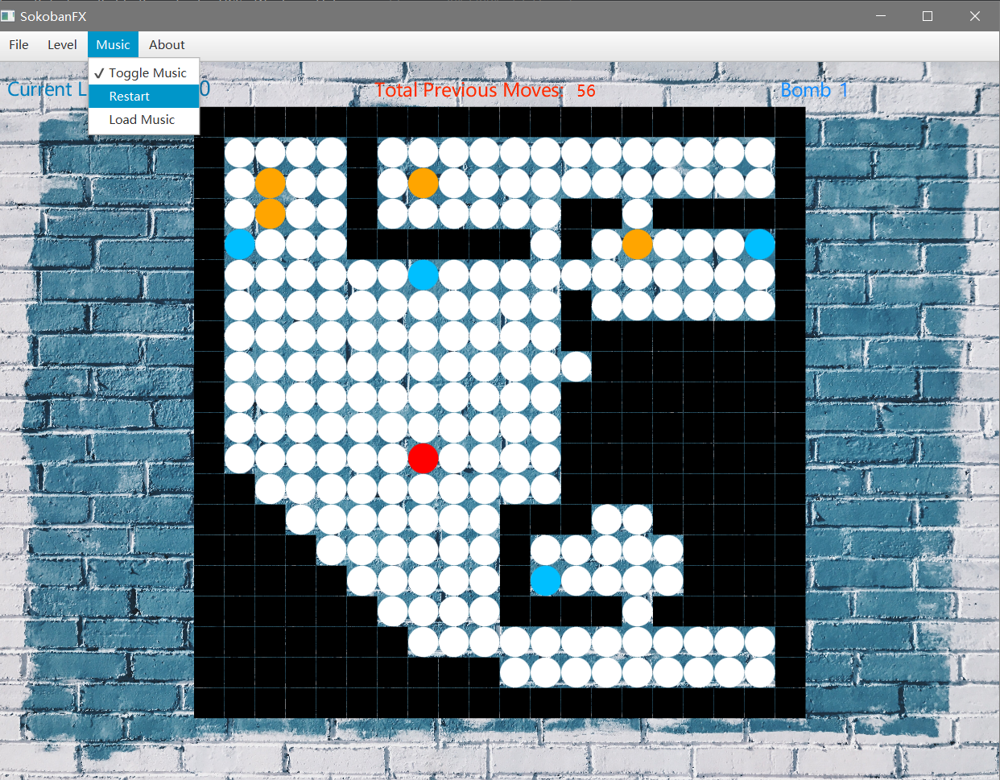

### Save Game

This feature allow the user to save file in **.skbSaved** format at the user-specified directory.

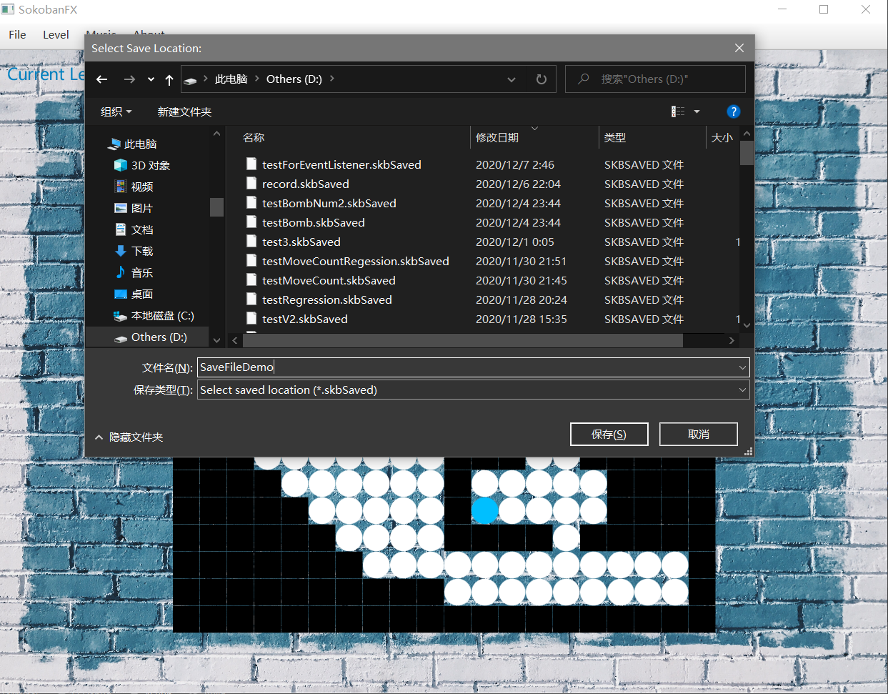

### Undo

This feature is to undo any latest movement of the keeper. However, as penalty, the move count will not decreases. This could be executed either by clicking the item or pressing the hot key, `Ctrl + Z`.

### Reset

This feature will reset the current level and the moves count of this level by clicking the button or the short cut key, `Ctrl + Shift + A`.

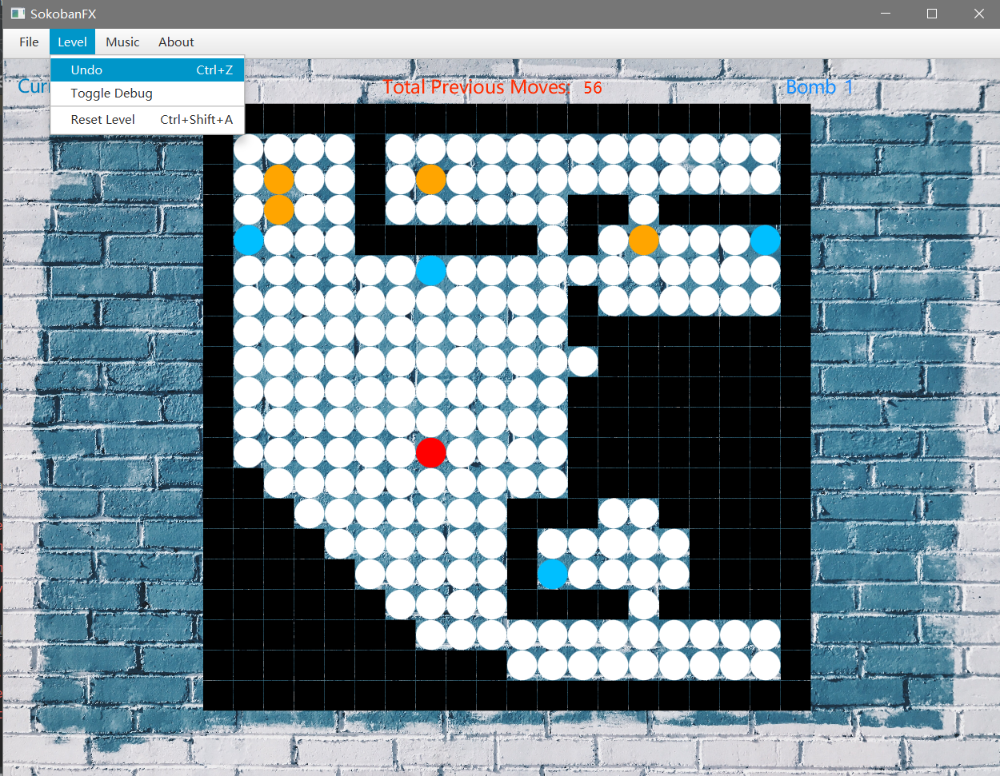

## Test

The logic of this project, `Model` package is tested, by **JUnit**, and **Assertj**, and **TestFX**. The Test Log is as follow, or clicking [here](docs/test_log.md)

## Conversion

This project is following [Alibaba Java Coding Guidelines](https://github.com/alibaba/Alibaba-Java-Coding-Guidelines) in design, naming, etc. This project also follow the [Conventional Commits](https://www.conventionalcommits.org/en/v1.0.0/).

## Copyright

```
Copyright 2020 Yizirui Fang.
```