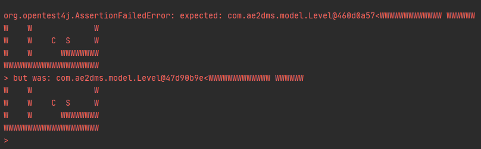
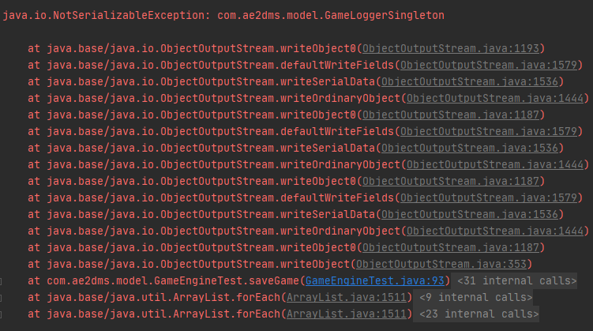
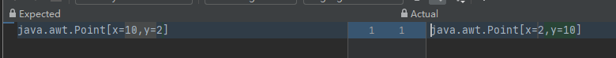
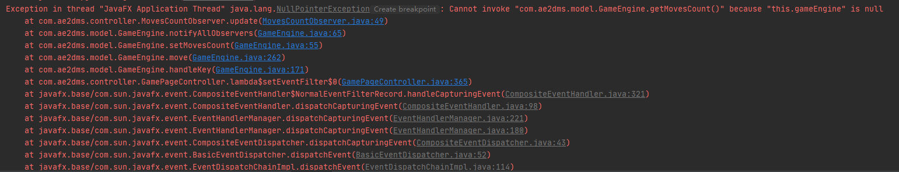
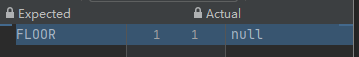

## GameEngineTest

### handleKey()

#### handleLeft()

### 

| No.  | Result        | Comparison | Test  Brief                                                  | Improvement |
| ---- | ------------- | ---------- | ------------------------------------------------------------ | ----------- |
| 1    | **Test pass** |            | This test is conducted by calling the `handle(KeyEvent.LEFT)` method on the new instance of `GameEngine` constructed by the test map file `debugGame.skb`. |             |

#### handleKeyRight()

### 

| No.  | Result        | Comparison | Test  Brief                                                  | Improvement |
| ---- | ------------- | ---------- | ------------------------------------------------------------ | ----------- |
| 1    | **Test pass** |            | This test is conducted by calling the `handle(KeyEvent.RIGHT)`method on the new instance of `GameEngine` constructed by the test map file `debugGame.skb`. |             |

#### handleKeyUp()

### 

| No.  | Result        | Comparison | Test  Brief                                                  | Improvement |
| ---- | ------------- | ---------- | ------------------------------------------------------------ | ----------- |
| 1    | **Test pass** |            | This test is conducted by calling the `handle(KeyEvent.Up)`method on the new instance of `GameEngine` constructed by the test map file `debugGame.skb`. |             |

#### handleKeyDown()

### 

| No.  | Result        | Comparison | Test  Brief                                                  | Improvement |
| ---- | ------------- | ---------- | ------------------------------------------------------------ | ----------- |
| 1    | **Test pass** |            | This test is conducted by calling the `handle(KeyEvent.Dow)`method on the new instance of `GameEngine` constructed by the test map file `debugGame.skb`. |             |

### isGameComplete()

### 

| No.  | Result        | Comparison | Test  Brief                                                  | Improvement |
| ---- | ------------- | ---------- | ------------------------------------------------------------ | ----------- |
| 1    | **Test pass** |            | This test is conducted by check if the value returned from `isGameComplete` of the new instance of `GameEngine` constructed by the test map file `debugGame.skb`. |             |

### undo()

In this test, the map file debugGame.skb would be applied to test.

| No.  | Result                                          | Comparison                                     |                         Test  Brief                          | Improvement                                                  |
| ---- | ----------------------------------------------- | ---------------------------------------------- | :----------------------------------------------------------: | ------------------------------------------------------------ |
| 1    | **Test fails** while the contents are identical |  | In the testing instance of `GameEngine`, move the keeper k once and undo, test the current with the new same level file |                                                              |
| 2    | **Test Pass**                                   |                                                | Compare the `movesCount` with `1`, the string of `objectsGrid` and `diamondsGrid` in the `currentLevel` of this instance of  `GameEngine` by applying function `toString` on all objects. | To test this function, we should examine if the two class is identical. This should not be done by comparing the reference of obejct but comparing field in these objects. |

### resetCurrentLevel()

| No.  | Result        | Comparison | Test  Brief                                                  | Improvement |
| ---- | ------------- | ---------- | ------------------------------------------------------------ | ----------- |
| 1    | **Test pass** |            | In one instance of `GameEngine`, move the keeper around by `handleKey` and call `resetCurrentLevel`. Compare the `movesCount` with `0`, the string of `objectsGrid` and `diamondsGrid` in the `currentLevel` of this instance of  `GameEngine`  with the new instance of `GameEnine` by applying function `toString` on all objects. |             |

### saveGame(File savedLocation)

| No.  | Result        | Comparison     | Test  Brief                                                  | Improvement                                                  |
| ---- | ------------- | -------------- | ------------------------------------------------------------ | ------------------------------------------------------------ |
| 1    | **Test fail** | Execution fail | When serialize `GameEngine`, the logger is also serialized. However, the logger should be maintained as **singleton**. It may occur duplicated logger after deserializing. |                                                              |
| 2    | **Test pass** |                |                                                              | Every logger field variable relevant to serialized class should be declared as  `transient` |

### field variable `public transient IntegerProperty movesCountsProperty;

| No.  | Result        | Comparison | Test  Brief                                                  | Improvement |
| ---- | ------------- | ---------- | ------------------------------------------------------------ | ----------- |
| 1    | **Test pass** |            | This test is conducted by moving left, up, right, and down in the `gameEngine` instance, and comparing the field variable `movesCountsProperty` with expected value `4`. |             |

### testIsGameComplete() 

| No.  | Result        | Comparison | Test  Brief                                                  | Improvement |
| ---- | ------------- | ---------- | ------------------------------------------------------------ | ----------- |
| 1    | **Test pass** |            | This test is conducted by calling the `isGameCompeted()` methods on the new instance of `GameEngine` constructed by the test map file `debugGame.skb`. |             |

### wallBomb()

| No.  | Result        | Comparison | Test  Brief                                                  | Improvement |
| ---- | ------------- | ---------- | ------------------------------------------------------------ | ----------- |
| 1    | **Test pass** |            | This test is conducted by bomb the wall in `(10,2)` of the `debugGame.skb` map, and test if the game object after calling this method at the specified location if `GameObject.FLOOR`. |             |

### keeperTransport()

#### keeperTransport()

| No.  | Result        | Comparison                                    | Test  Brief                                                  | Improvement                                                  |
| ---- | ------------- | --------------------------------------------- | ------------------------------------------------------------ | ------------------------------------------------------------ |
| 1    | **Test fail** |  | This test is conducted by applying this method in the new gameEngine and compare the result with the specified location |                                                              |
| 2    | **Test pass** |                                               | Same as above.                                               | The issue is about the test method. The `Point` returned by the function `getKeeperPosition` is in format `row, column`. The expected value of keeper location should be in `row, column` format instead of `column, row`. |

### move()

#### testMoveDown()

| No.  | Result        | Comparison | Test  Brief                                                  | Improvement |
| ---- | ------------- | ---------- | ------------------------------------------------------------ | ----------- |
| 1    | **Test pass** |            | This test is conducted by calling the `move(new Point(1,0))` method on the new instance of `GameEngine` constructed by the test map file `debugGame.skb`. |             |

#### testMoveUp()

### 

| No.  | Result        | Comparison | Test  Brief                                                  | Improvement |
| ---- | ------------- | ---------- | ------------------------------------------------------------ | ----------- |
| 1    | **Test pass** |            | This test is conducted by calling the `move(new Point(-1,0))` method on the new instance of `GameEngine` constructed by the test map file `debugGame.skb`. |             |

#### testMoveLeft()

### 

| No.  | Result        | Comparison | Test  Brief                                                  | Improvement |
| ---- | ------------- | ---------- | ------------------------------------------------------------ | ----------- |
| 1    | **Test pass** |            | This test is conducted by calling the `move(new Point(0,-1))` method on the new instance of `GameEngine` constructed by the test map file `debugGame.skb`. |             |

#### testMoveRight()

### 

| No.  | Result        | Comparison | Test  Brief                                                  | Improvement |
| ---- | ------------- | ---------- | ------------------------------------------------------------ | ----------- |
| 1    | **Test pass** |            | This test is conducted by calling the `move(new Point(0,1))` method on the new instance of `GameEngine` constructed by the test map file `debugGame.skb`. |             |

### isDebugActive()

### 

| No.  | Result        | Comparison | Test  Brief                                                  | Improvement |
| ---- | ------------- | ---------- | ------------------------------------------------------------ | ----------- |
| 1    | **Test pass** |            | This test is conducted by checking if the default value of `GameEngine.debug`.got by calling `GameEngine.isDebugActive` is false |             |

### toggleDebug()

### 

| No.  | Result        | Comparison | Test  Brief                                                  | Improvement |
| ---- | ------------- | ---------- | ------------------------------------------------------------ | ----------- |
| 1    | **Test pass** |            | This test is conducted by checking if the value of `GameEngine.debug`.got by calling `GameEngine.isDebugActive` in the new instance of `gameEngine` constructed by the test map file `debugGame.skb`. is true after calling `GameEngine.toggleDebug` |             |

## MusicPlayer

### togglePlay()

|      |      |      |      |      |
| ---- | ---- | ---- | ---- | ---- |
|      |      |      |      |      |

## GamePageController

### gameGridClickEventListener()

| No.  | Result        | Comparison                                               | Test  Brief                                                  | Improvement |
| ---- | ------------- | -------------------------------------------------------- | ------------------------------------------------------------ | ----------- |
| 1    | **Test Fail** | Expected: wall becomes floor Actual: wall becomes keeper | See in (issue 38()[[Bug reported about the clicking event on the game grid (#40) · Issues · scyyf1 / AE2DMS-CW-20127091 · GitLab (nottingham.edu.cn)](https://csprojects.nottingham.edu.cn/scyyf1/ae2dms-cw-20127091/-/issues/40)] |             |
|      |               |                                                          |                                                              |             |

### onLoadMusicButtonClicked()

| No.  | Result        | Comparison | Test  Brief                                                  | Improvement                                                  |
| ---- | ------------- | ---------- | ------------------------------------------------------------ | ------------------------------------------------------------ |
| 1    | **Test Fail** | Exception  | This result is issued in [issue #39]([Bug reported, for playing the default music file, fail to resume after pasuing (#39) · Issues · scyyf1 / AE2DMS-CW-20127091 · GitLab (nottingham.edu.cn)](https://csprojects.nottingham.edu.cn/scyyf1/ae2dms-cw-20127091/-/issues/39)). When resume music after pause the music, the program is significantly likely to break. The exception message is as follow:`java.io.FileNotFoundException: file:\D:\csProject\ae2dms-cw-20127091\target\classes\music\puzzle_theme.wav (文件名、目录名或卷标语法不正确。) at java.base/java.io.FileInputStream.open0(Native Method) at java.base/java.io.FileInputStream.open(FileInputStream.java:211) at java.base/java.io.FileInputStream.<init>(FileInputStream.java:153) at java.desktop/com.sun.media.sound.SunFileReader.getAudioInputStream(SunFileReader.java:117) at java.desktop/javax.sound.sampled.AudioSystem.getAudioInputStream(AudioSystem.java:1062) at com.ae2dms.controller.MusicPlayer.resetAudioStream(MusicPlayer.java:196) at com.ae2dms.controller.MusicPlayer.resumeAudio(MusicPlayer.java:179) at com.ae2dms.controller.MusicPlayer.togglePlay(MusicPlayer.java:114) at com.ae2dms.controller.GamePageController.toggleMusic(GamePageController.java:150) at java.base/jdk.internal.reflect.NativeMethodAccessorImpl.invoke0(Native Method) at java.base/jdk.internal.reflect.NativeMethodAccessorImpl.invoke(NativeMethodAccessorImpl.java:64) at java.base/jdk.internal.reflect.DelegatingMethodAccessorImpl.invoke(DelegatingMethodAccessorImpl.java:43) at java.base/java.lang.reflect.Method.invoke(Method.java:564) at com.sun.javafx.reflect.Trampoline.invoke(MethodUtil.java:76) at jdk.internal.reflect.GeneratedMethodAccessor2.invoke(Unknown Source) at java.base/jdk.internal.reflect.DelegatingMethodAccessorImpl.invoke(DelegatingMethodAccessorImpl.java:43) at java.base/java.lang.reflect.Method.invoke(Method.java:564) at javafx.base/com.sun.javafx.reflect.MethodUtil.invoke(MethodUtil.java:273) at javafx.fxml/com.sun.javafx.fxml.MethodHelper.invoke(MethodHelper.java:83) at javafx.fxml/javafx.fxml.FXMLLoader$MethodHandler.invoke(FXMLLoader.java:1859) at javafx.fxml/javafx.fxml.FXMLLoader$ControllerMethodEventHandler.handle(FXMLLoader.java:1729) at javafx.base/com.sun.javafx.event.CompositeEventHandler.dispatchBubblingEvent(CompositeEventHandler.java:86) at javafx.base/com.sun.javafx.event.EventHandlerManager.dispatchBubblingEvent(EventHandlerManager.java:234) at javafx.base/com.sun.javafx.event.EventHandlerManager.dispatchBubblingEvent(EventHandlerManager.java:191) at javafx.base/com.sun.javafx.event.BasicEventDispatcher.dispatchEvent(BasicEventDispatcher.java:58) at javafx.base/com.sun.javafx.event.EventDispatchChainImpl.dispatchEvent(EventDispatchChainImpl.java:114) at javafx.base/com.sun.javafx.event.EventUtil.fireEventImpl(EventUtil.java:74) at javafx.base/com.sun.javafx.event.EventUtil.fireEvent(EventUtil.java:49) at javafx.base/javafx.event.Event.fireEvent(Event.java:198) at javafx.controls/javafx.scene.control.MenuItem.fire(MenuItem.java:459) at javafx.controls/com.sun.javafx.scene.control.ContextMenuContent$MenuItemContainer.doSelect(ContextMenuContent.java:1385) at javafx.controls/com.sun.javafx.scene.control.ContextMenuContent$MenuItemContainer.lambda$createChildren$12(ContextMenuContent.java:1338) at javafx.base/com.sun.javafx.event.CompositeEventHandler$NormalEventHandlerRecord.handleBubblingEvent(CompositeEventHandler.java:247) at javafx.base/com.sun.javafx.event.CompositeEventHandler.dispatchBubblingEvent(CompositeEventHandler.java:80) at javafx.base/com.sun.javafx.event.EventHandlerManager.dispatchBubblingEvent(EventHandlerManager.java:234) at javafx.base/com.sun.javafx.event.EventHandlerManager.dispatchBubblingEvent(EventHandlerManager.java:191) at javafx.base/com.sun.javafx.event.CompositeEventDispatcher.dispatchBubblingEvent(CompositeEventDispatcher.java:59) at javafx.base/com.sun.javafx.event.BasicEventDispatcher.dispatchEvent(BasicEventDispatcher.java:58) at javafx.base/com.sun.javafx.event.EventDispatchChainImpl.dispatchEvent(EventDispatchChainImpl.java:114) at javafx.base/com.sun.javafx.event.BasicEventDispatcher.dispatchEvent(BasicEventDispatcher.java:56) at javafx.base/com.sun.javafx.event.EventDispatchChainImpl.dispatchEvent(EventDispatchChainImpl.java:114) at javafx.base/com.sun.javafx.event.BasicEventDispatcher.dispatchEvent(BasicEventDispatcher.java:56) at javafx.base/com.sun.javafx.event.EventDispatchChainImpl.dispatchEvent(EventDispatchChainImpl.java:114) at javafx.base/com.sun.javafx.event.BasicEventDispatcher.dispatchEvent(BasicEventDispatcher.java:56) at javafx.base/com.sun.javafx.event.EventDispatchChainImpl.dispatchEvent(EventDispatchChainImpl.java:114) at javafx.base/com.sun.javafx.event.EventUtil.fireEventImpl(EventUtil.java:74) at javafx.base/com.sun.javafx.event.EventUtil.fireEvent(EventUtil.java:54) at javafx.base/javafx.event.Event.fireEvent(Event.java:198) at javafx.graphics/javafx.scene.Scene$MouseHandler.process(Scene.java:3856) at javafx.graphics/javafx.scene.Scene.processMouseEvent(Scene.java:1851) at javafx.graphics/javafx.scene.Scene$ScenePeerListener.mouseEvent(Scene.java:2584) at javafx.graphics/com.sun.javafx.tk.quantum.GlassViewEventHandler$MouseEventNotification.run(GlassViewEventHandler.java:409) at javafx.graphics/com.sun.javafx.tk.quantum.GlassViewEventHandler$MouseEventNotification.run(GlassViewEventHandler.java:299) at java.base/java.security.AccessController.doPrivileged(AccessController.java:391) at javafx.graphics/com.sun.javafx.tk.quantum.GlassViewEventHandler.lambda$handleMouseEvent$2(GlassViewEventHandler.java:447) at javafx.graphics/com.sun.javafx.tk.quantum.QuantumToolkit.runWithoutRenderLock(QuantumToolkit.java:412) at javafx.graphics/com.sun.javafx.tk.quantum.GlassViewEventHandler.handleMouseEvent(GlassViewEventHandler.java:446) at javafx.graphics/com.sun.glass.ui.View.handleMouseEvent(View.java:556) at javafx.graphics/com.sun.glass.ui.View.notifyMouse(View.java:942) at javafx.graphics/com.sun.glass.ui.win.WinApplication._runLoop(Native Method) at javafx.graphics/com.sun.glass.ui.win.WinApplication.lambda$runLoop$3(WinApplication.java:174) at java.base/java.lang.Thread.run(Thread.java:832)` |                                                              |
| 2    | **Test Pass** |            | Without any change, in IDE debug model, the program works fine. |                                                              |
| 3    | **Test Pass** |            |                                                              | This [issue #39]([Bug reported, for playing the default music file, fail to resume after pasuing (#39) · Issues · scyyf1 / AE2DMS-CW-20127091 · GitLab (nottingham.edu.cn)](https://csprojects.nottingham.edu.cn/scyyf1/ae2dms-cw-20127091/-/issues/39)) is fixed in [commit 0c9dbf69]() |

## GamePageControllerTest

### setMovesCountEventListener()

| No.  | Result        | Comparison      | Test  Brief                                                  | Improvement                                                  |
| ---- | ------------- | --------------- | ------------------------------------------------------------ | ------------------------------------------------------------ |
| 1    | **Test fail** | Compiling fails | This is a **Regression Test** on save game. When saving the game, the compiling fails, the compiler message is as follow: |                                                              |
| 2    | **Test pass** |                 |                                                              | This issue is also reported in [issue 30]([Bug reported in move count after loading saved file (#30) · Issues · scyyf1 / AE2DMS-CW-20127091 · GitLab (nottingham.edu.cn)](https://csprojects.nottingham.edu.cn/scyyf1/ae2dms-cw-20127091/-/issues/30)). And, this is solved by refactoring and new serializing feature. The main improvement is logged in [commit 08fc2f630acd638b5ac7fb60f9d238b49df1b599]([refactor(move count): refactor the observer pattern on the move count feature... (08fc2f63) · Commits · scyyf1 / AE2DMS-CW-20127091 · GitLab (nottingham.edu.cn)](https://csprojects.nottingham.edu.cn/scyyf1/ae2dms-cw-20127091/-/commit/08fc2f630acd638b5ac7fb60f9d238b49df1b599)),[commit 8f34339f1c610c261ef0502172932c46044bdfb2]([fix(moves count): the field variable `movesCountsProperty` is not... (8f34339f) · Commits · scyyf1 / AE2DMS-CW-20127091 · GitLab (nottingham.edu.cn)](https://csprojects.nottingham.edu.cn/scyyf1/ae2dms-cw-20127091/-/commit/8f34339f1c610c261ef0502172932c46044bdfb2)), and [commit c2ecd54765f951d4d4b9a3c9261d8145691c6433]([fix(move counts): fix the bug issued in #30. This is fixed by moving the event... (c2ecd547) · Commits · scyyf1 / AE2DMS-CW-20127091 · GitLab (nottingham.edu.cn)](https://csprojects.nottingham.edu.cn/scyyf1/ae2dms-cw-20127091/-/commit/c2ecd54765f951d4d4b9a3c9261d8145691c6433)). |

## GameGrid

#### translatePoint(Point sourceLocation, Point delta)

| No.  | Result        | Comparison                                 | Test  Brief                                                  | Improvement                                                  |
| ---- | ------------- | ------------------------------------------ | ------------------------------------------------------------ | ------------------------------------------------------------ |
| 1    | **Test fail** |  | This test is conducted by checking if the only `GameObject` in the `20*20` instance of `GameGrid` could be translated by `Point(1,1)`. |                                                              |
| 2    | **Test Pass** |                                            |                                                              | The tested method `GameGrid.translatePoint`will return the `Point` object instead of `GameObject` |

#### getTargetFromSource()

| No.  | Result        | Comparison | Test  Brief                                                  | Improvement |
| ---- | ------------- | ---------- | ------------------------------------------------------------ | ----------- |
| 1    | **Test Pass** |            | This method is tested by `putGameObjectAt` and then check `GameObject` of the putted location by `getTargetFromSource()`. |             |

### getGameObjectAt()

| No.  | Result        | Comparison | Test  Brief                                                  | Improvement |
| ---- | ------------- | ---------- | ------------------------------------------------------------ | ----------- |
| 1    | **Test Pass** |            | This method is tested by `putGameObjectAt` and then check `GameObject` of the putted location by `getGameObjectAt(Point p)`. |             |